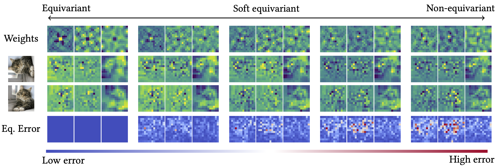
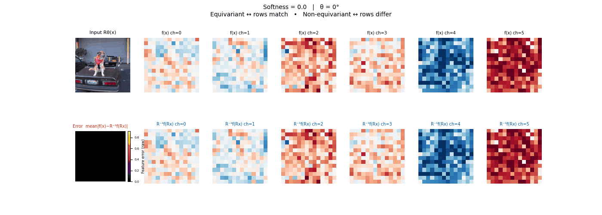
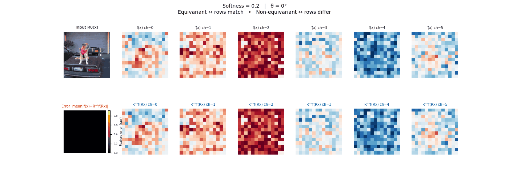
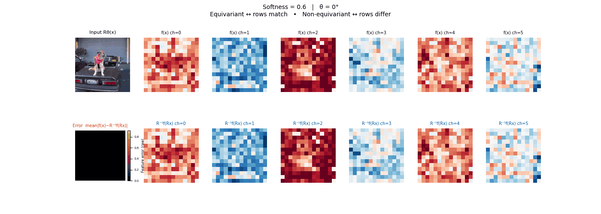
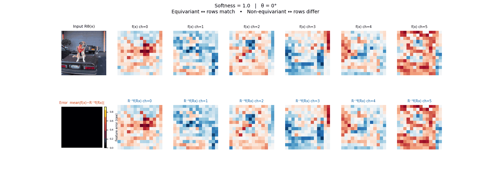
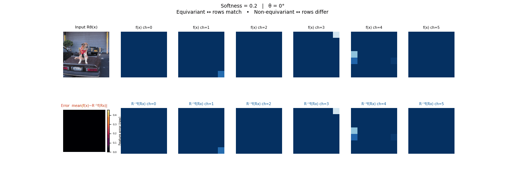
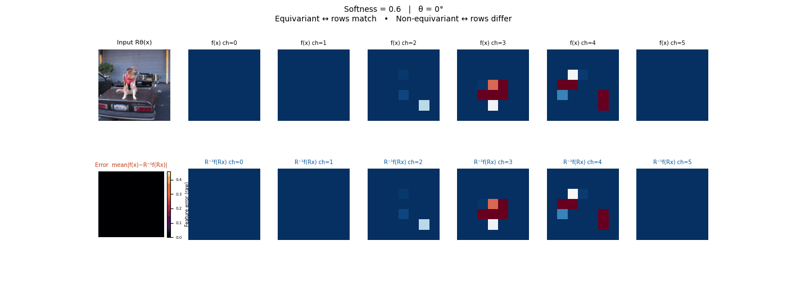
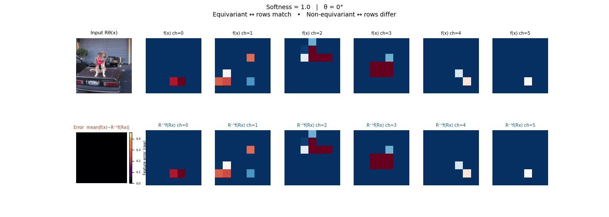
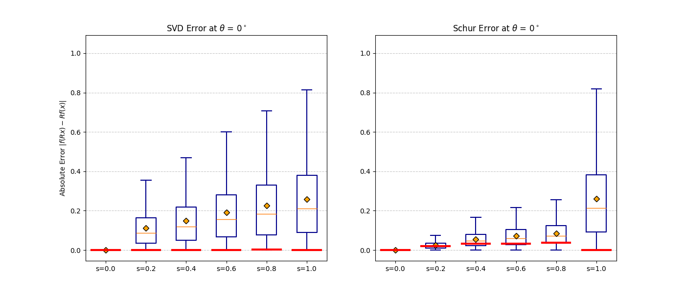
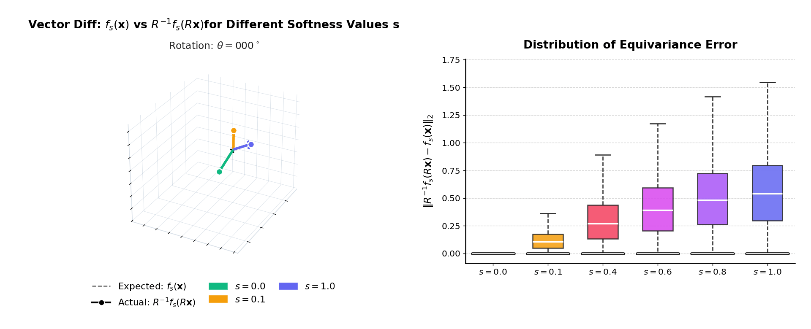

# Tunable Soft Equivariance with Guarantee (CVPR 2026)


[](https://arxiv.org/pdf/2603.26657)



## Overview
This repository contains the official code for **Tunable Soft Equivariance with Guarantee (CVPR 2026)**.
We introduce *soft equivariance*: a simple mechanism that **continuously interpolates** between strict group equivariance and the original (pretrained) model, controlled by a single softness parameter.

The implementation is designed for practical use in modern vision stacks (such as ViT / ResNet / DINOv2 / SegFormer) and scientific settings (equivariant MLPs for O(5) and Lorentz groups), with lightweight tooling for training and evaluating robustness/consistency under group actions. 

## Installation
Run the following:
```bash
pip install -r requirements.txt
```

Notes:
- **Equivariant-MLP (EMLP)**: you can install from PyPI (`pip install emlp`) or use the bundled copy in `external/equivariant-MLP/` (see its `setup.py` at `external/equivariant-MLP/setup.py`).
- Most vision backbones rely on HuggingFace `transformers` and will download pretrained weights on first use.

## Quick start
At a high level, **soft equivariance** is implemented by *filtering (projecting) pretrained weights to suitable subspaces at forward time*. The degree of equivariance is controlled by a parameter named **softness** (ranging from 0.0 to 1.0), where 0.0 corresponds to strict equivariance and 1.0 corresponds to the original weights (unconstrained).

For Linear layers/convolutional kernels (or patch projections), we wrap the original layer and apply an invariant/equivariant projector before using the weights. 

Core building blocks:
- Filter factory: `softeq/equi_utils/filter_factory.py`
- Filtered convolution wrapper: `softeq/layers/fconv2d.py`
- Filtered ViT monkeypatches: `models/filtered_layers_vit.py`
- Filtered ResNet wrapper: `models/filtered_resnet.py`
- Filtered Linear wrapper: `softeq/layers/flinear.py`

<details>
<summary><b>🔷 ViT (patch projection + positional embeddings) · ℹ︎ details</b></summary>

|  |  |
|---|---|
| <b>softness = 0.0</b><br/> | <b>softness = 0.2</b><br/> |
| <b>softness = 0.6</b><br/> | <b>softness = 1.0</b><br/> |

**Schema**

1) Load pretrained ViT (HuggingFace)

2) Replace the patch projection conv with a filtered version and smooth the learned positional embeddings

```text
ViT (pretrained)
	└─ patch_embeddings.projection : Conv2d
				↓ replaced with
		 FilteredConv2d(Conv2d, invariant_filter)

position_embeddings
	└─ position_embeddings[:, 1:, :]  (excluding CLS)
				↓ smoothed by an invariant filter
```

**Where in the code**
- Model wrapper: `models/filtered_vit.py`
- Monkeypatch details: `models/filtered_layers_vit.py`

**Standalone / notebooks**
- Notebooks: `notebooks/vit_rotation.ipynb` (figures/gifs under `notebooks/figs/`)
- Standalone (All-in-one demo): `standalone/vit_rotation_standalone.py`

*Construction is similar for DINOv2*

</details>

<details>
<summary><b>🔷 ResNet (filter all Conv2d kernels &gt; 1×1) · ℹ︎ details</b></summary>

| |  |
|---|---|
| <b>softness = 0.0</b><br/> | <b>softness = 0.2</b><br/> |
| <b>softness = 0.6</b><br/> | <b>softness = 1.0</b><br/> |

**Schema**

1) Load pretrained ResNet (HuggingFace)

2) Recursively replace every `nn.Conv2d` with `kernel_size &gt; 1` by `FilteredConv2d`

```text
ResNet (pretrained)
	├─ Conv2d(7×7), Conv2d(3×3), ...   → filtered
	└─ Conv2d(1×1) shortcuts           → kept unfiltered
```

**Where in the code**
- Model wrapper: `models/filtered_resnet.py`
- Filter wrapper: `softeq/layers/fconv2d.py`

**Standalone / notebooks**
- Standalone (All-in-one demo): `standalone/resnet_soft_equivariance_standalone.py`

</details>

<details>
<summary><b>🔷 O(5) equivariant MLP (scientific / structured data) · ℹ︎ details</b></summary>



**Schema**

Soft-equivariant projection is applied to each linear map using O(5) equivariant/invariant filters:

```text
Input (representation)
	→ FilteredLinear (equivariant)
	→ EQNonLin
	→ ...
	→ FilteredLinear (invariant to scalar)
	→ Output
```

**Where in the code**
- Model: `models/filtered_o5.py`
- Filters: `softeq/equi_utils/o5_filter.py`

**Standalone / notebooks**
- Standalone (all in one): `standalone/mlp_o5_standalone.py`
- Notebooks: `notebooks/mlp_o5.ipynb`

</details>

<details>
<!-- <summary><b>SO(3) demo</b></summary>



</details>

<details> -->
<summary><b>🔷 Add your own group (SO(3) example) · ℹ︎ details</b></summary>

The intended extension pattern is:

1) Implement your the abstract class in `equi_utils/base_constraints.py` (mirroring `RotationConstraints` / `RotoReflectionConstraints`).

2) Use it to wrap a layer:
	- Conv layers: use `softeq/layers/fconv2d.py` (`FilteredConv2d`)
	- Linear layers: use `softeq/layers/flinear.py` (`FilteredLinear`)
3) To use the training pipeline here
	- Add projector (from step 1) in `softeq/equi_utils/`.
 	- Add a constructor in `softeq/equi_utils/filter_factory.py`.

---

#### Example: adding **SO(3)** (continuous rotations in 3D)

SO(3) is a **multi-generator** continuous group (3 Lie algebra generators). In this repo, the reference implementation is provided as a worked example you can adapt:


**Reference notebook (end-to-end):**
- `notebooks/mlp_so3.ipynb` (defines an `SO3Constraints` class and builds invariant/equivariant projections for 3D vector MLPs)

**Reference standalone script (single file):**
- `standalone/so3_inavariant_standalone.py`

**Core building blocks used by the SO(3) path:**
- Constraints interface for new groups: `softeq/equi_utils/base_constraints.py`
- SO(3) Lie algebra generators / vector actions: `softeq/utils/group_utils_vec.py`
- Invariant projector: `softeq/equi_utils/inv_projector.py`
- Equivariant projector(s): `softeq/equi_utils/equi_projectors.py`
- Filtered linear wrapper: `softeq/layers/flinear.py`

If you’re implementing a new group, the quickest path is to copy the structure of `SO3Constraints` from `notebooks/mlp_so3.ipynb`, then expose a filter constructor (like the existing rotation/roto-reflection factories) and wrap your target layers using `FilteredConv2d` / `FilteredLinear`.

</details>

## 🔷🔷 Standalone demos and notebooks
- `standalone/` contains “all-in-one” scripts with inlined dependencies for quick experiments.
- `notebooks/` contains exploratory notebooks and figures/gifs (saved under `notebooks/figs/`).

## Huggingface Releases
*Models will be added soon.*

## Experiments
Experiments are defined in `config/` and launched from `./scripts/`.


## Thanks to
We gratefully acknowledge the open-source projects that made this work possible:
- [Equivariant-MLP (EMLP)](https://github.com/mfinzi/equivariant-MLP) for representation-theoretic building blocks and reference implementations.
- [transformers](https://github.com/huggingface/transformers), and [timm](https://github.com/huggingface/pytorch-image-models) for the model and training ecosystem used throughout this repository.

## BibTeX
```bibtex
@InProceedings{rahman2026tunable,
	author    = {Rahman, Md Ashiqur and Hao, Lim Jun and Jiang, Jeremiah and Lim, Teck-Yian and Yeh, Raymond A},
	title     = {Tunable Soft Equivariance with Guarantee},
	booktitle = {Proceedings of the IEEE/CVF Conference on Computer Vision and Pattern Recognition (CVPR)},
	year      = {2026}
}
```

